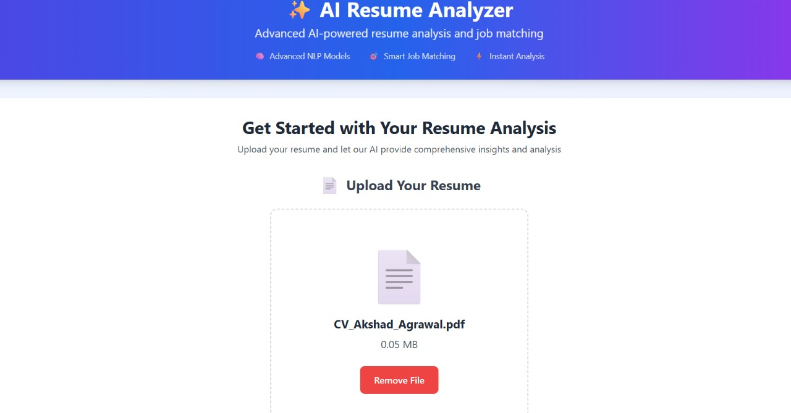

# FOSS Recruitment 2025 - Shlok Garg

## Student Details
- **Name**: Shlok Garg  
- **PRN**: 24070122187 
- **Year**: 2nd
- **Branch**: CSE

---

## Problem Statement
This project aims to streamline the recruitment process by providing a platform for job profile management and candidate evaluation using machine learning models. It features a  frontend and a robust backend to handle data and predictions efficiently.

---

## Features
- Manage job profiles and candidate data
- Machine learning-based predictions
- RESTful API endpoints
- Modern, responsive UI with reusable components
- Toast notifications and interactive features

---

## Tech Stack
- **Backend:** Python (Flask/FastAPI), Machine Learning libraries
- **Frontend:** React, Tailwind CSS, JavaScript
- **Other:** Node.js, CRACO, PostCSS

---

## How to Run

### Backend
1. Open the `backened` folder in VS Code or terminal.
2. Install dependencies:
	```sh
	pip install -r requirement.txt
	```
3. Copy `.env.example` to `.env` and fill in required environment variables.
4. Run the backend server:
	```sh
	python main.py
	```

### Frontend
1. Open the `frontend` folder in VS Code or terminal.
2. Install dependencies:
	```sh
	npm install
	```
3. Configure `.env` if needed.
4. Start the development server:
	```sh
	npm start
	```

---

## Project Structure

```
Shlok_Garg/
├── Readme.md
├── backened/
│   ├── .env.example
│   ├── job_profiles.py
│   ├── main.py
│   ├── ml_models.py
│   ├── models.py
│   ├── requirement.txt
│   ├── routes.py
│   └── utils.py
└── frontend/
	 ├── .env
	 ├── components.json
	 ├── craco.config.js
	 ├── jsconfig.json
	 ├── package.json
	 ├── postcss.config.js
	 ├── tailwind.config.js
	 ├── lib/
	 │   └── utlis.js
	 ├── public/
	 └── src/
		  ├── App.js
		  ├── components/
		  │   └── ui/
		  │       ├── accordion.jsx
		  │       ├── ... (other UI components)
		  └── hooks/
				└── use_toast.js
```

---

## Demo Screenshot / Output
Add a screenshot of your project running, or copy-paste sample terminal output here.

---

## AI Tools Used
GitHub Copilot

---

## Future Improvements
- Add authentication and user roles
- Enhance ML models for better predictions
- Improve UI/UX and add more interactive features
- Add comprehensive test coverage

---

## Notes for Reviewers
This project is designed to run both frontend and backend locally. Please ensure you have Python and Node.js installed.

---

## Submission Checklist 
- [x] Cloned the Repository 
- [x] Added my details (Name, PRN, Year, Branch)  
- [x] Wrote Problem Statement  
- [x] Listed Features & Tech Stack  
- [x] Added clear Run Instructions  
- [ ] Provided Demo Output (screenshot or text)  
- [x] Listed AI tools used (or None)  
- [x] Explained Future Improvements  
- [x] Project runs offline

